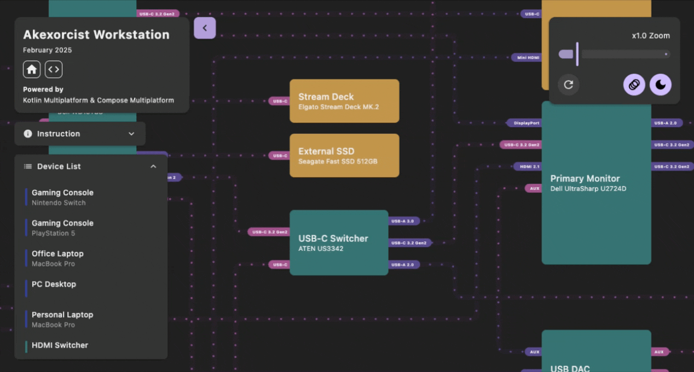

# Workstation Diagram - Documentation

## Overview

Workstation Diagram is a Kotlin Multiplatform application for visualizing and editing workstation hardware configurations. This documentation focuses on understanding the project's architecture, design concepts, and how systems work together.

## Project Structure

Three main modules:
- **shared** - Common code (data models, serialization, validation, utilities)
- **viewer** - Read-only visualization (Desktop JVM and Web WASM/JS)
- **editor** - Interactive editing (Desktop JVM and Web WASM/JS)

## Key Concepts

- **Coordinate System**: Virtual coordinate system (10000×10000 canvas) for resolution independence
- **Viewport Navigation**: Point-based zooming and pan operations
- **Connection Routing**: Grid-based pathfinding with obstacle avoidance
- **Rendering**: Multi-layer rendering with Bezier curves and animations

## Technology Stack

- **Language**: Kotlin
- **UI Framework**: Compose Multiplatform
- **Platforms**: JVM (Desktop), WASM/JS (Web)

## Documentation

### Core
- [PROJECT_OVERVIEW.md](PROJECT_OVERVIEW.md) - High-level project understanding

### Architecture & Design
- [ARCHITECTURE.md](ARCHITECTURE.md) - System architecture and design patterns
- [STATE_MANAGEMENT.md](STATE_MANAGEMENT.md) - State management concepts

### Core Systems
- [COORDINATE_SYSTEM.md](COORDINATE_SYSTEM.md) - Coordinate system design
- [VIEWPORT_SYSTEM.md](VIEWPORT_SYSTEM.md) - Viewport navigation and interaction
- [ROUTING_SYSTEM.md](ROUTING_SYSTEM.md) - Connection routing architecture
- [RENDERING_SYSTEM.md](RENDERING_SYSTEM.md) - Visual rendering concepts

### Data & Validation
- [DATA_MODEL.md](DATA_MODEL.md) - Data structure concepts
- [VALIDATION.md](VALIDATION.md) - Validation rules and concepts

### Editor
- [EDITING_SYSTEM.md](EDITING_SYSTEM.md) - Editing capabilities

## License

Licensed under the Apache License, Version 2.0. See [LICENSE](../LICENSE) for details.
