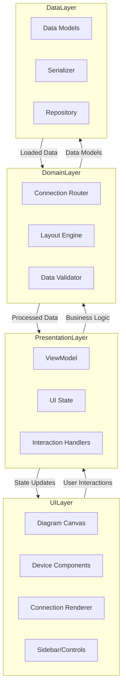
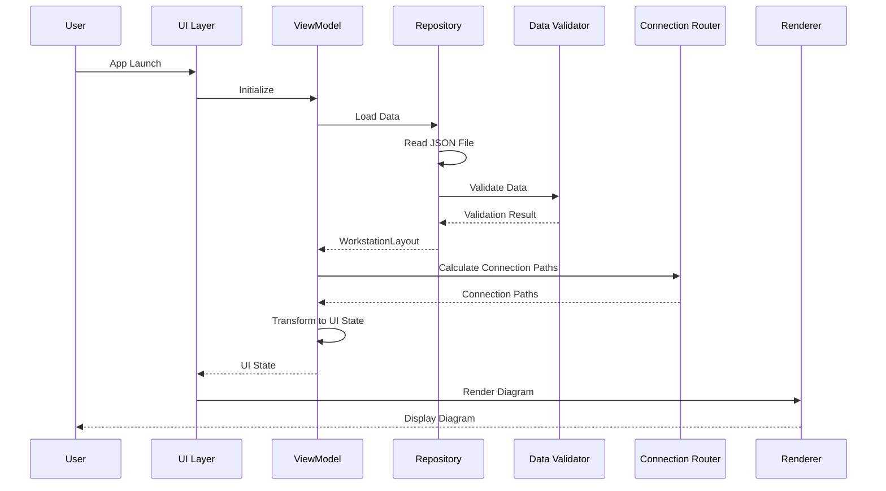

# Project Overview & Architecture

## Project Overview

A Kotlin Multiplatform + Compose Multiplatform application that displays an interactive diagram of a workstation setup. The application shows devices, their specifications, wired connections between devices, and connection details (type, input/output ports). The layout algorithm minimizes connection crossings for a clean, beautiful visualization.

**Target Platforms:** Web (via Compose for Web) and Desktop (via Compose Desktop)  
**Configuration:** Static data (no runtime editing)

## Architecture & Separation of Concerns

### Layer Architecture



### Core Principles

1. **Separation of Concerns:**
   - **Data Layer:** Pure data models, no UI dependencies
   - **Domain Layer:** Business logic (layout algorithms, connection routing) independent of UI
   - **Presentation Layer:** State management, UI state transformation
   - **UI Layer:** Pure rendering, no business logic

2. **Dependency Direction:** UI → Presentation → Domain → Data (unidirectional)

3. **Platform Agnostic:** Shared business logic, platform-specific only for entry points

4. **Testability:** Each layer independently testable

## Data Flow

### Data Loading & Processing Flow



## Project Structure

```
work-station/
├── build.gradle.kts                 # Root build config
├── settings.gradle.kts
├── gradle.properties
│
├── commonMain/                      # Shared Kotlin code
│   ├── kotlin/
│   │   ├── data/
│   │   │   ├── model/               # Data models
│   │   │   │   ├── Device.kt
│   │   │   │   ├── Connection.kt
│   │   │   │   ├── Layout.kt
│   │   │   │   └── Port.kt
│   │   │   ├── repository/
│   │   │   │   └── WorkstationRepository.kt
│   │   │   ├── validation/
│   │   │   │   └── DataValidator.kt
│   │   │   └── serialization/
│   │   │       └── WorkstationLayoutSerializer.kt
│   │   │
│   │   ├── domain/
│   │   │   ├── layout/
│   │   │   │   ├── ConnectionRouter.kt
│   │   │   │   ├── DeviceLayoutEngine.kt
│   │   │   │   ├── PortPositionCalculator.kt
│   │   │   │   ├── PathPlanner.kt
│   │   │   │   ├── CrossingDetector.kt
│   │   │   │   ├── PathOptimizer.kt
│   │   │   │   ├── ConnectionBundler.kt
│   │   │   │   ├── LabelPositionCalculator.kt
│   │   │   │   └── CollisionDetector.kt
│   │   │   └── util/
│   │   │       ├── GeometryUtils.kt
│   │   │       ├── MathUtils.kt
│   │   │       ├── CoordinateTransformer.kt
│   │   │       ├── SpatialIndex.kt
│   │   │       └── PathMeasure.kt
│   │   │
│   │   └── presentation/
│   │       ├── WorkstationViewModel.kt
│   │       ├── WorkstationUiState.kt
│   │       ├── DiagramState.kt
│   │       ├── ConnectionPathCalculator.kt
│   │       ├── ViewportManager.kt
│   │       ├── ViewportCuller.kt
│   │       ├── Theme.kt
│   │       ├── DeviceStyle.kt
│   │       ├── KeyboardShortcutHandler.kt
│   │       └── PreferencesManager.kt
│   │
│   └── resources/
│       └── data/
│           └── workstation.json     # Static data file
│
├── composeMain/                     # Shared Compose UI
│   └── kotlin/
│       └── ui/
│           ├── WorkstationDiagramScreen.kt
│           ├── components/
│           │   ├── DiagramCanvas.kt
│           │   ├── DeviceComponent.kt
│           │   ├── ConnectionLine.kt
│           │   ├── PortIndicator.kt
│           │   ├── DeviceLabel.kt
│           │   └── ConnectionAnimation.kt
│           ├── sidebar/
│           │   ├── DeviceListSidebar.kt
│           │   └── DeviceListItem.kt
│           ├── controls/
│           │   ├── ZoomControl.kt
│           │   ├── ThemeToggle.kt
│           │   ├── AnimationToggle.kt
│           │   └── ExportButton.kt
│           ├── details/
│           │   ├── DeviceDetailsPanel.kt
│           │   └── ConnectionDetailsPanel.kt
│           ├── accessibility/
│           │   └── AccessibilitySupport.kt
│           └── components/
│               └── Tooltip.kt
│
├── desktopMain/                     # Desktop-specific
│   └── kotlin/
│       └── Main.kt
│
├── jsMain/                          # Web-specific
│   └── kotlin/
│       └── Main.kt
│
└── plan/                            # Planning documents
```

## Dependencies

```kotlin
// build.gradle.kts (commonMain)
dependencies {
    // Compose Multiplatform
    implementation(compose.runtime)
    implementation(compose.foundation)
    implementation(compose.ui)
    implementation(compose.material3)
    
    // Serialization
    implementation("org.jetbrains.kotlinx:kotlinx-serialization-json:1.6.0")
    
    // Coroutines
    implementation("org.jetbrains.kotlinx:kotlinx-coroutines-core:1.7.3")
}
```

## Critical Implementation Notes

1. **Start Simple:** Begin with straight-line connections, then add routing algorithms
2. **Performance First:** Implement viewport culling early to handle large diagrams
3. **Validate Early:** Add data validation from the start to catch issues early
4. **Test Algorithms:** Unit test layout algorithms thoroughly - they're complex
5. **Progressive Enhancement:** Build core features first, polish later
6. **Platform Testing:** Test on both web and desktop regularly during development

## Summary of Key Concerns Addressed

### Architecture & Design
✅ **Separation of Concerns:** Clear layer separation (UI → Presentation → Domain → Data)  
✅ **Unidirectional Data Flow:** State flows down, events flow up  
✅ **Platform Agnostic:** Shared business logic, platform-specific only for entry points  
✅ **Testability:** Each layer independently testable  

### Data Management
✅ **Data Models:** Comprehensive models for devices, connections, ports, specifications  
✅ **Data Validation:** Complete validation rules for data integrity  
✅ **Error Handling:** Graceful error handling with recovery strategies  
✅ **Versioning:** Data format versioning for future compatibility  
✅ **Serialization:** JSON serialization with migration support  

### Layout & Rendering
✅ **Connection Routing:** Multi-stage algorithm for beautiful paths  
✅ **Crossing Minimization:** Layer-based routing to minimize visual clutter  
✅ **Collision Detection:** Path collision with devices handled  
✅ **Port Positioning:** Optimal port distribution along device edges  
✅ **Coordinate Systems:** Proper transformation between world/canvas/screen space  
✅ **Viewport Management:** Zoom, pan, and viewport culling for performance  

### User Experience
✅ **Interactivity:** Click, hover, selection, keyboard navigation  
✅ **Visual Design:** Color coding, device categories, connection styling  
✅ **Accessibility:** Screen reader support, keyboard navigation, high contrast  
✅ **Responsive:** Adapts to different screen sizes  
✅ **Animations:** Smooth connection animations with performance considerations  
✅ **Tooltips & Details:** Rich information display on demand  

### Performance
✅ **Viewport Culling:** Only render visible elements  
✅ **Spatial Indexing:** Fast lookup for culling operations  
✅ **Caching:** Cache expensive calculations (paths, layouts)  
✅ **Async Processing:** Use coroutines for heavy computations  
✅ **Level of Detail:** Simplified rendering at low zoom levels  

### Platform Support
✅ **Web:** Browser compatibility, responsive design, URL parameters  
✅ **Desktop:** Window management, file system access, native features  
✅ **Shared Code:** Maximum code sharing between platforms  

### Additional Features
✅ **Search/Filter:** Device search and filtering  
✅ **Export:** Image and data export functionality  
✅ **Keyboard Shortcuts:** Efficient navigation and actions  
✅ **State Persistence:** Remember user preferences  
✅ **Theme Support:** Dark/light themes with system detection  

### Testing & Quality
✅ **Unit Tests:** Algorithm and data validation tests  
✅ **UI Tests:** Component and interaction tests  
✅ **Integration Tests:** End-to-end workflows  
✅ **Documentation:** Comprehensive documentation strategy  

