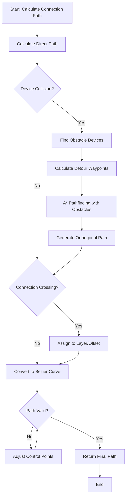

# Domain Layer - Algorithms & Logic

## Connection Routing Algorithm

**Problem:** Minimize connection crossings and create beautiful, readable connection paths.

**Solution:** Multi-stage routing algorithm

**File:** `domain/layout/ConnectionRouter.kt`

### Algorithm Stages

1. **Port Assignment:** Assign connection endpoints to specific port positions on devices
2. **Path Planning:** Use A* or Dijkstra-like algorithm to find optimal paths
3. **Crossing Minimization:** Detect and resolve crossings using:
   - Orthogonal routing (prefer horizontal/vertical segments)
   - Layer assignment (assign connections to different "layers" to reduce visual clutter)
   - Bezier curve smoothing for final rendering

### Key Classes

- `ConnectionRouter`: Main routing logic
- `PathPlanner`: Calculates connection paths
- `CrossingDetector`: Detects and counts crossings
- `PathOptimizer`: Optimizes paths to reduce crossings

## Connection Path Calculation Details

**File:** `domain/layout/PathPlanner.kt`

### Path Planning Steps

1. **Initial Path:**
   - Straight line from source port to target port
   - Check for device collisions

2. **Obstacle Avoidance:**
   - Identify devices in path
   - Calculate detour points
   - Use A* with device obstacles

3. **Path Smoothing:**
   - Convert orthogonal path to Bezier curves
   - Calculate control points for smooth curves
   - Ensure curves don't intersect devices

4. **Crossing Minimization:**
   - Detect crossings with other connections
   - Adjust path to reduce crossings
   - Use layer assignment for unavoidable crossings

### Algorithm Flow



### Algorithm Pseudocode

```
1. Calculate direct path (source port → target port)
2. Check for device collisions
3. If collisions:
   a. Find obstacle devices
   b. Calculate detour waypoints
   c. Use A* pathfinding with obstacles
4. Convert to Bezier curve
5. Check for connection crossings
6. Adjust layers/offsets to minimize crossings
7. Return final path
```

## Connection Crossing Minimization

**Algorithm:** Layer-based routing with crossing detection

**File:** `domain/layout/ConnectionRouter.kt`

### Implementation Approach

- Divide canvas into layers (like PCB routing)
- Assign connections to layers based on priority
- Use orthogonal routing (prefer 90-degree turns)
- Detect crossings and reassign layers
- Apply Bezier smoothing for final rendering

**File:** `domain/layout/CrossingDetector.kt`

- Detect intersections between connection paths
- Count total crossings
- Identify which connections cross
- Calculate crossing severity (angle, proximity)

**File:** `domain/layout/PathOptimizer.kt`

- Reorder connections to minimize crossings
- Adjust connection offsets
- Assign to different layers
- Optimize path segments

## Device Layout Algorithm

**Problem:** Position devices optimally to minimize connection lengths and crossings.

**Solution:** Force-directed layout with constraints

**File:** `domain/layout/DeviceLayoutEngine.kt`

### Algorithm

- Use force-directed graph layout (Fruchterman-Reingold or similar)
- Apply constraints:
  - Device size constraints
  - Minimum spacing between devices
  - Preferred positions (if specified in data)
- Iterative refinement to minimize total connection length

### Key Classes

- `DeviceLayoutEngine`: Main layout coordinator
- `ForceCalculator`: Calculates forces between devices
- `ConstraintSolver`: Applies constraints to layout

**Note:** Since positions are static in data, this algorithm is primarily for validation and potential auto-layout features in the future.

## Port Position Calculation

**Problem:** Determine optimal port positions on device boundaries.

**File:** `domain/layout/PortPositionCalculator.kt`

### Algorithm

- Analyze all connections from/to a device
- Group ports by side (top, bottom, left, right)
- Distribute ports evenly along each side
- Consider connection directions to minimize path complexity

### Port Distribution Strategy

1. **Force-based Distribution:**
   - Calculate "attraction" forces from connections
   - Distribute ports along device edges to minimize total connection length
   - Group related ports together

2. **Even Distribution:**
   - Distribute ports evenly along each side
   - Maintain minimum spacing between ports
   - Respect port offset constraints from data

## Port Position Optimization

**Algorithm:** Force-based port distribution

**File:** `domain/layout/PortPositionCalculator.kt`

- Calculate "attraction" forces from connections
- Distribute ports along device edges to minimize total connection length
- Group related ports together

## Bezier Curve Path Generation

**Algorithm:** Cubic Bezier with control points

**File:** `domain/layout/PathPlanner.kt`

- Calculate control points based on device positions
- Ensure smooth curves that avoid device boundaries
- Support orthogonal and curved routing modes

### Bezier Curve Calculation

- Use cubic Bezier curves (4 control points)
- Calculate control points to maintain smoothness
- Ensure curves don't intersect device boundaries
- Adjust control points for minimum clearance

## Connection Path Collision Detection

**Problem:** Ensure connection paths don't overlap with devices unnecessarily.

**File:** `domain/layout/CollisionDetector.kt`

### Collision Detection

1. **Device Collision:**
   - Check if connection path intersects device bounds
   - Calculate minimum distance from path to device
   - Adjust path to maintain minimum clearance

2. **Path Optimization:**
   - Use A* pathfinding with device obstacles
   - Create "no-go zones" around devices
   - Prefer paths that avoid device centers

**File:** `domain/layout/PathPlanner.kt` (enhanced)

- Include device bounds as obstacles in pathfinding
- Calculate clearance distance
- Generate paths that respect device boundaries

## Connection Bundling

**Problem:** Handle multiple connections between same devices.

**File:** `domain/layout/ConnectionBundler.kt`

### Strategy

- Detect parallel connections (same source/target devices)
- Calculate optimal offset spacing
- Group related connections visually
- Stagger connections with small offsets
- Use layer assignment for visual separation

## Label Position Calculation

**Problem:** Position connection labels optimally.

**File:** `domain/layout/LabelPositionCalculator.kt`

### Algorithm

- Calculate optimal label positions along paths
- Position labels at midpoint of connection path
- Detect label collisions
- Adjust label positions to avoid overlaps
- Avoid overlapping with devices or other connections
- Rotate label to follow connection angle

## Coordinate System & Transformations

**Problem:** Handle coordinate transformations between world space, canvas space, and screen space.

**File:** `domain/util/CoordinateTransformer.kt`

### Coordinate Systems

1. **World Space:** Absolute device positions in data (e.g., 0-1920, 0-1080)
2. **Canvas Space:** Transformed coordinates after zoom/pan
3. **Screen Space:** Final pixel coordinates on screen

### Transformation Pipeline

```
World Space → Apply Zoom → Apply Pan → Screen Space
```

### Key Functions

- `worldToScreen(worldPoint: Point, zoom: Float, pan: Offset): Point`
- `screenToWorld(screenPoint: Point, zoom: Float, pan: Offset): Point`
- `worldToScreenRect(worldRect: Rect, ...): Rect`
- Handle viewport bounds and clipping

## Viewport Management

**File:** `presentation/ViewportManager.kt`

### Responsibilities

- Manage viewport state (bounds, zoom, pan)
- Calculate visible area in world coordinates
- Handle zoom limits (min/max)
- Center on specific device/area
- Fit-to-viewport functionality

### Zoom Limits

- Minimum zoom: 0.1x (10% zoom out)
- Maximum zoom: 5.0x (500% zoom in)
- Default zoom: 1.0x

## Viewport Culling & Performance

**Problem:** Only render visible elements for performance with large diagrams.

**File:** `presentation/ViewportCuller.kt`

### Culling Strategy

1. **Device Culling:**
   - Check if device bounds intersect viewport
   - Use spatial index (quadtree or grid) for fast lookup
   - Only render devices in viewport + margin

2. **Connection Culling:**
   - Check if connection path intersects viewport
   - Consider connection bounding box
   - Skip connections between culled devices (unless path visible)

3. **Port Culling:**
   - Only render ports of visible devices
   - Skip port indicators below certain zoom level

**File:** `domain/util/SpatialIndex.kt`

- Implement quadtree or grid-based spatial index
- Fast lookup of devices in viewport
- Update index when layout changes

### Performance Optimizations

- Use `LaunchedEffect` with viewport changes to recalculate culling
- Cache culling results until viewport changes
- Use `remember` for expensive culling calculations
- Implement level-of-detail (LOD) rendering (simplified at low zoom)

## Path Measurement Utilities

**File:** `domain/util/PathMeasure.kt`

### Responsibilities

- Utility to calculate points along Bezier paths
- Support for distance-based positioning
- Handle path length calculations
- Calculate positions for animation along paths

## Geometry Utilities

**File:** `domain/util/GeometryUtils.kt`

### Functions

- Line intersection detection
- Point-in-rectangle checks
- Distance calculations
- Angle calculations
- Bounding box calculations
- Path intersection detection

## Math Utilities

**File:** `domain/util/MathUtils.kt`

### Functions

- Bezier curve calculations
- Vector operations
- Matrix transformations
- Clamping and normalization
- Interpolation functions

